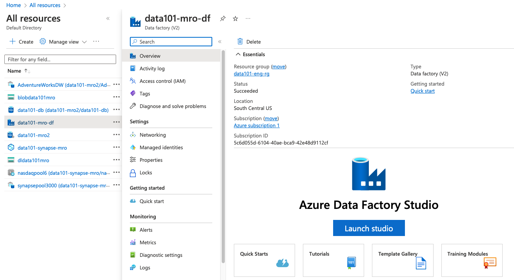
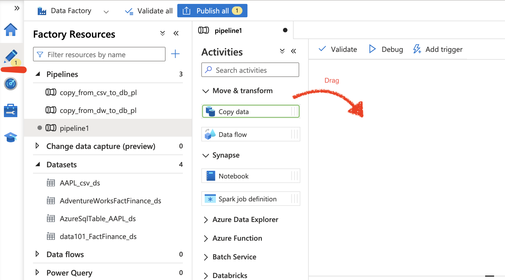
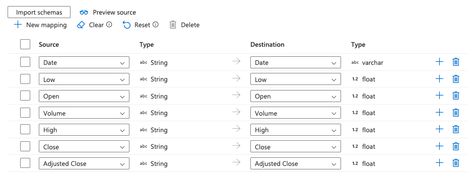
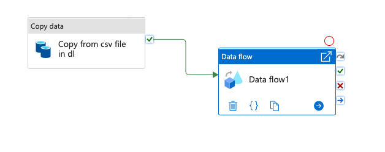
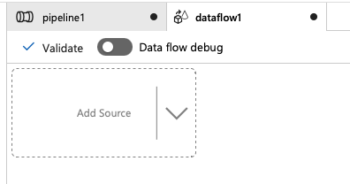
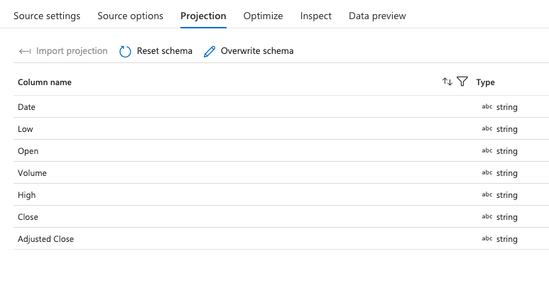
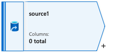
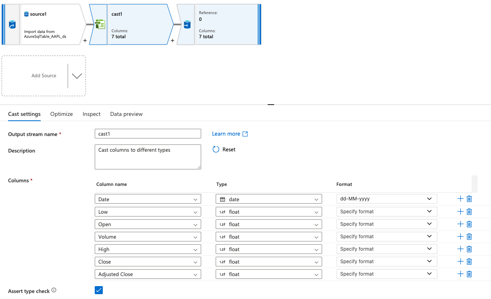
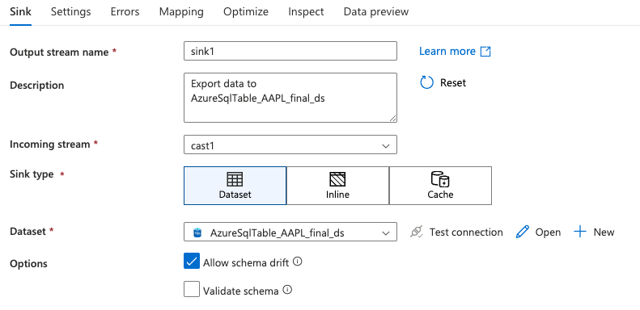
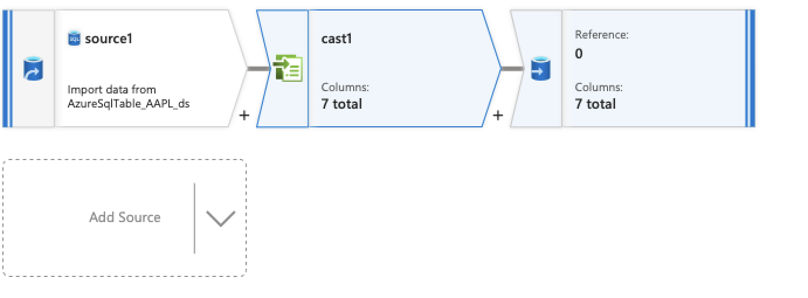

# ADF Data Load

In this practice we will create different pipelines to load (Copy) data from different resources to a database or to a data warehouse.

&nbsp; 

### Prerrequisites
* Create 4 tables in your azure database: AAPL_landing, AAPL, FRED_GDP_landing, FRED_GDP
* Go to SSMS or Azure Data Studio, select the database you created before ("data101-db"), open a new query and run:

        CREATE TABLE AAPL_landing (
            "Date" varchar(200),
            Low varchar(200),
            "Open" varchar(200),
            Volume varchar(200),
            High varchar(200),
            "Close" varchar(200),
            "Adjusted Close" varchar(200)
        );

        CREATE TABLE FRED_GDP_landing (
            "Date" varchar(200),
            "Value" varchar(200)
        );

        CREATE TABLE AAPL (
            "Date" date,
            Low float,
            "Open" float,
            Volume float,
            High float,
            "Close" float,
            "Adjusted Close" float
        );

        CREATE TABLE FRED_GDP (
            "Date" date,
            "Value" float
        );

* ## Create the "AAPL_landing" table also in your data warehouse ("AdventureWorksDW")
  
&nbsp; 

### What you will learn
* Azure Data Factory workspace
* How to LOAD data from a datalake into database
* How to LOAD data from a HTTP source into a DB
* How to LOAD data from a DB into a DW
* TRANSFORM data types with Data Flow activities in ADF
* How to LOAD data from a datalake into Snowflake (Optional)

&nbsp; 

# Practice

You are a data engineer working for a credit rating agency. You need to get Stock Market Data every day, store it in a Data Warehouse for financial research and analysis for further publication. You work in the team responsible of getting data from the Nasdaq Index from different resources or formats.

On your azure portal, go to **All Resources**, select the data factory you created in the past session, and click on **Launch Studio**

Remember that for each **Copy** activity, we will create a source dataset and a sink dataset.

&nbsp; 

## STEP 1: ADF Copy Activities

&nbsp; 

**Copy from datalake to database**

* Once in the Data Factory Studio, on your most left panel, select **Author**
  
* Click ... con **Pipelines** and create a new pipeline
* Under the **Activities** panel, select and drag **Copy data**
  
* On the most right panel, select a name for your pipeline, similar to "csv_to_db_pl" or any name
* Under the workspace area you will find all the configurations for your activity. You can set any name for your activity
  
* Go to Source in the activity configurations and create a new source dataset
* Search for **Azure Blob Storage**, then select **DelimitedText**
* Select a name for your dataset, could be "AAPL_csv_ds" (you can also rename datasets later)
* Select the **Linked service** for Blob Storage created in the past session, similar to "blobdata101_ls"
* Browse for the file called "AAPL.csv" in the "data" folder
* Check the box for **First row as header**
* On **Import schema** you can import from connection/store or select none (later you can import the schema as well)
* Click **OK**
* On the activity configurations, go to **Sink** and create a new dataset
* Search for **Azure SQL Database**
* Set a name for your dataset ("AzureSQLTable_AAPL_landing_ds"), select the linked service for the azure db you created in the past session
* Select "dbo.AAPL_landing" table
* You can import the schema or import it later
* Under your activit configurations go to **Mapping** and **Import schemas** (so you can view mapping/transformation options)
  
* For fixed or known schemas it is usefull to import the schemas and review or modify your mappings. Here you can also preview the data (not all sources allow data preview).
* In this case, **Clear** the schema (at this moment we will not make any transformation since we are building ELT pipelines)
* If everything looks like expected, on the upper tabs of your workspace, click **Validate** and if there are no errors, click on **Publish** (saves the pipeline in your Data Factory workspace) and then **Debug** or **Trigger now**

&nbsp; 

**Copy from http to database**

* Create a new pipeline, set a propper name
* Drag a new **Copy data** activity
* Go to Source in the activity configurations and create a new source dataset
* Search for **HTTP**, then select **DelimitedText**
* Select a name for your dataset, could be "http_fredGDP_csv_ds" (you can also rename datasets later)
* Select the **Linked service** for http created in the past session, similar to "nasdaq_http_ls"
* Enter the following relative url:
  
        api/v3/datasets/FRED/GDP.csv?collapse=annual&order=asc&column_index=1

* Check the box for **First row as header**
* On **Import schema** you can import from connection/store or select none (later you can import the schema)
* Click **OK**
* On the activity configurations, go to **Sink** and create a new dataset
* Search for **Azure SQL Database**
* Set a name for your dataset ("AzureSQLTable_FREDGDP_landing_ds"), select the linked service for the azure db you created in the past session
* Select "dbo.FRED_GDP_landing" table
* You can import the schema or import it later
* Under your activit configurations go to **Mapping**
* If everything looks like expected, on the upper tabs of your workspace, click **Validate** and if there are no errors, click on **Publish** (saves the pipeline in your Data Factory workspace) and then **Debug** or **Trigger now**
* Nasdaq Data Link API: [info](https://docs.data.nasdaq.com/docs/time-series), [rate/limits](https://docs.data.nasdaq.com/docs/rate-limits)

&nbsp; 

**Copy from database to data warehouse**

* Create a new pipeline, set a propper name
* Drag a new **Copy data** activity
* Go to Source in the activity configurations and select the dataset you created as sink for Azure DB ("AzureSQLTable_AAPL_landing_ds") in the previews steps
* Leave the defaults
* Go to **Sink** tab and create a new dataset
* Search for **Azure Synapse Analytics**
* Set a name for your dataset, could be "AAPL_dw_ds" (you can also rename datasets later)
* Select the linked service for the DW you created in the past session ("adventureworks_dw_ls")
* Select "AAPL_landing" table
* Do not import schema and click **OK**
* Click **Validate** and if there are no errors, click on **Publish** (saves the pipeline in your Data Factory workspace) and then **Debug** or **Trigger now**
* Go to Data Studio or SMSS, create a new query for your "AdventureWorksDW" and run:

&nbsp; 

        SELECT TOP 100 * FROM dbo.AAPL_landing;

* DELETE: Once you can view the data in your DW, on your Azure portal, go to **All resources** select and delete "AdventureWorksDW" resource to keep the cost at the minimum.

&nbsp; 

&nbsp; 

# ADF Transformations

In this practice we will start with simple transformations using data flow activity in ADF. This could also be achieved with a sql script, but for this session we will use the Azure Data Factory GUI.

Keep in mind that there is not just one way to build a pipeline. It will depend on your business needs and resources available or even personal preference.

&nbsp; 

## Data type transformation:

**Data Flow (AAPL)**
* In your ADF workspace, create a new pipeline and drag a **Data Flow** activity. You could also add the activity in the "copy_from_csv_to_db_pl" pipeline so it would run the transformation inmediatly after the LOAD process. If you choose the second option it should look like this:
  
* Click on the Data flow activity, and in the tabs that appear below, select **Settings** and click **New**
  
* Select **Add Source**
  
  
* On **Source settings** select the dataset "AzureSqlTable_AAPL_ds" and leave the defaults
  
* On the **Projection** tab you can preview the schema and data types
  
* Click on the + icon beside the source image and select **Cast**:
  
  
* On the **Cast settings** tab make sure to set everything as the image below
  
* Now click the **+** and select **Sink**
* Under the **Sink settings** set the corresponding values:
* You will need to create a New dataset using the SQL Database linked service and selecting "AAPL" table.
  

&nbsp; 

**Data Flow (FRED_GDP)**
* We will add another flow in the same activity. It will be the same as the above but for FRED_GDP data. This could be done in separate activities, but it is important to aknowledge the capacities of this tool. In fact, in ELT processes and datawarehousing many transformations involve more than one source, like when creating a Fact or a Dim table in a DW, or you just need a Join or a Lookup or other functions in your transformation pipeline and more than one source is required.
* Add another source:
  
* Now select the FredGdp dataset 
* Add a **Cast** step
* **Important**: Under **Cast settings**, make sure that you select the correct date format for casting. Check your FRED_GDP dataset or the csv file in the Blob Storage for the adequate date format.
* Create a sink dataset selecting "FRED_GDP" table

&nbsp; 

* Now you can go to the pipeline and **Trigger now**
* You can go to SSMS or Data Studio and run

        SELECT TOP 100 * FROM dbo.AAPL;

  And then

        SELECT TOP 100 * FROM dbo.FRED_GDP;

  You have succesfully completed this transformations!

&nbsp; 

Note: **Data flow** activities in ADF are very useful and efficient for low complexity transformations. However, for high complexity transformations, it is recomended to use Spark on Synapse or Spark on Databricks or other specialized tool for transformations.

&nbsp; 

&nbsp; 

# Optional: Load to Snowflake

&nbsp; 

**Copy from datalake to snowflake**

* Create a new pipeline, set a propper name
* Drag a new **Copy data** activity
* Go to Source in the activity configurations and create a new source dataset
* Search for **Azure Blob Storage**, then select **DelimitedText**
* Select a name for your dataset, could be "snowflake_data_csv_ds" (you can also rename datasets later)
* Select the **Linked service** for Blob Storage created in the past session, similar to "blobdata101_ls"
* Browse for the file called "data.csv" in the "data" folder
* Check the box for **First row as header**
* On **Import schema** you can import from connection/store or select none (later you can import the schema)
* Click **OK**
* On the activity configurations, go to **Sink** and create a new dataset
* Search for **Snowflake**
* Set a name for your dataset ("Snowflake_data__sink_ds"), select the linked service for snowflake you created before
* Fill in the correct values
* Under your activit configurations go to **Mapping**
* If everything looks like expected, on the upper tabs of your workspace, click **Validate** and if there are no errors, click on **Publish** (saves the pipeline in your Data Factory workspace) and then **Debug** or **Trigger now**
* You can go to your Snowflake account and you will find your data there!

&nbsp; 

&nbsp; 

# Setting things up for Session 18

At least ONE HOUR BEFORE session 18:
* Go to your Synapse workspace and create a new spark pool and upload requirements.txt. It takes aproximately 60 min to provision. Here are the [steps](../session_18_ADF_Transform/README.md).

