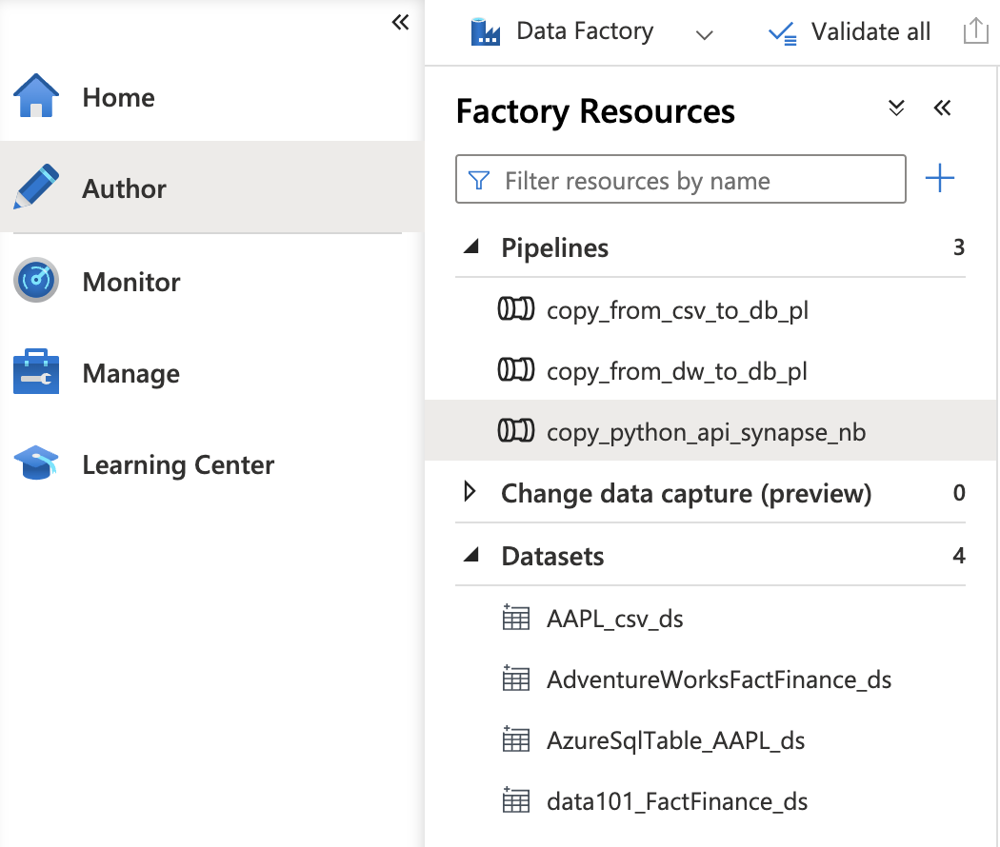
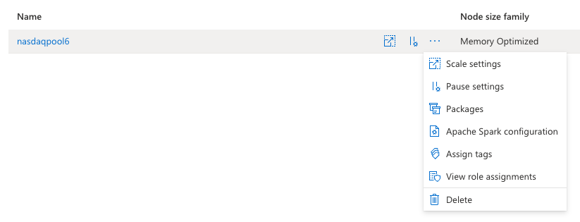
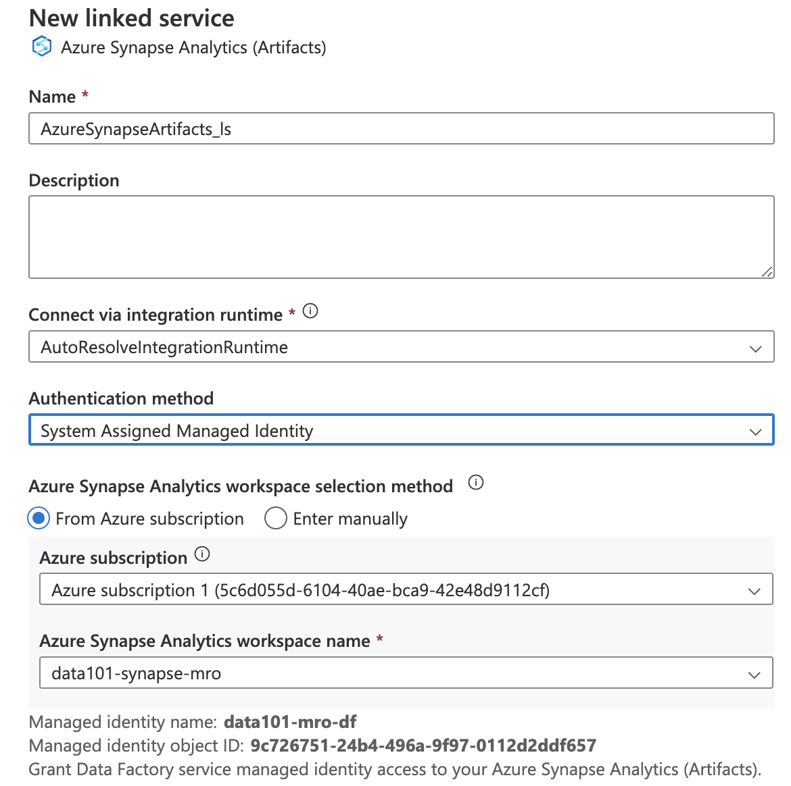
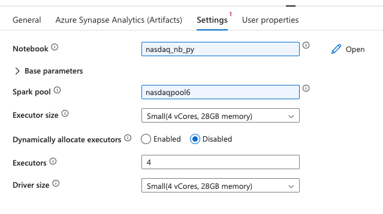

# ADF Data Load

In this practice we will create different pipelines to load (Copy) data from different resources to a database or to a data warehouse.

&nbsp; 

### Prerrequisites
* Create 2 tables in your azure database, FRED_GDP and AAPL
* Go to SMSS or Azure Data Studio, select the database you created before ("data101-db"), open a new query and run:

        CREATE TABLE AAPL (
            "Date" varchar(200),
            Low varchar(200),
            "Open" varchar(200),
            Volume varchar(200),
            High varchar(200),
            "Close" varchar(200),
            "Adjusted Close" varchar(200)
        );

         CREATE TABLE AAPL_synapse (
            "Date" varchar(200),
            Low varchar(200),
            "Open" varchar(200),
            Volume varchar(200),
            High varchar(200),
            "Close" varchar(200),
            "Adjusted Close" varchar(200)
        );

        CREATE TABLE FRED_GDP (
            "Date" varchar(200),
            "Value" varchar(200)
        );
* Create the "AAPL" table also in your data warehouse
  
&nbsp; 

### What you will learn
* Azure Data Factory workspace
* Azure Synapse workspace
* How to LOAD data from a datalake into data warehouse or database
* How to LOAD data from a HTTP source into a DB
* How to LOAD data from a DB into a DW
* How to LOAD data from a python script (API + Spark dataframe) into a DB
* How to LOAD data from a datalake into Snowflake
* Add permission/role for Synapse in ADF

&nbsp; 

# Practice

Remember that for each **Copy** activity, we will create a source dataset and a sink dataset.

On your azure portal, go to **All Resources**, select the data factory you created in the past session, and click on **Launch Studio**
  

&nbsp; 

## STEP 1: ADF Copy Activities

&nbsp; 

**Copy from datalake to database**

* Once in the Data Factory Studio, on your most left panel, select **Author**
  
* Click ... con **Pipelines** and create a new pipeline
* Under the **Activities** panel, select and drag **Copy data**
  
* On the most right panel, select a name for your pipeline, similar to "csv_to_db_pl" or any name
* Under the workspace area you will find all the configurations for your activity. You can set any name for your activity
  
* Go to Source in the activity configurations and create a new source dataset
* Search for **Azure Blob Storage**, then select **DelimitedText**
* Select a name for your dataset, could be "AAPL_csv_ds" (you can also rename datasets later)
* Select the **Linked service** for Blob Storage created in the past session, similar to "blobdata101_ls"
* Browse for the file called "AAPL.csv" in the "data" folder
* Check the box for **First row as header**
* On **Import schema** you can import from connection/store or select none (later you can import the schema)
* Click **OK**
* On the activity configurations, go to **Sink** and create a new dataset
* Search for **Azure SQL Database**
* Set a name for your dataset ("AzureSQLTable_AAPL_ds"), select the linked service for the azure db you created in the past session
* Select "dbo.AAPL" table
* You can import the schema or import it later
* Under your activit configurations go to **Mapping**
  
  
For fixed or known schemas it is usefull to import the schemas and review or modify your mappings. Here you can also preview the data (not all sources allow data preview).

* If everything looks like expected, on the upper tabs of your workspace, click **Validate** and if there are no errors, click on **Publish** (saves the pipeline in your Data Factory workspace) and then **Debug** or **Trigger now**

&nbsp; 

**Copy from http to database**

* Create a new pipeline, set a propper name
* Drag a new **Copy data** activity
* Go to Source in the activity configurations and create a new source dataset
* Search for **HTTP**, then select **DelimitedText**
* Select a name for your dataset, could be "AAPL_csv_ds" (you can also rename datasets later)
* Select the **Linked service** for Blob Storage created in the past session, similar to "blobdata101_ls"
* Enter the following relative url:
  
        api/v3/datasets/FRED/GDP.csv?collapse=annual&order=asc&column_index=1

* Check the box for **First row as header**
* On **Import schema** you can import from connection/store or select none (later you can import the schema)
* Click **OK**
* On the activity configurations, go to **Sink** and create a new dataset
* Search for **Azure SQL Database**
* Set a name for your dataset ("AzureSQLTable_AAPL_ds"), select the linked service for the azure db you created in the past session
* Select "dbo.AAPL" table
* You can import the schema or import it later
* Under your activit configurations go to **Mapping**
* If everything looks like expected, on the upper tabs of your workspace, click **Validate** and if there are no errors, click on **Publish** (saves the pipeline in your Data Factory workspace) and then **Debug** or **Trigger now**

&nbsp; 

**Copy from database to data warehouse**

* Create a new pipeline, set a propper name
* Drag a new **Copy data** activity
* Go to Source in the activity configurations and create a new source dataset
* Search for **Azure SQL Database**
* Set a name for your dataset ("AzureSQLTable_AAPL_source_ds"), select the linked service for the azure db you created in the past session
* Select "dbo.AAPL" table
* You can import the schema or import it later
* On **Import schema** you can import from connection/store or select none (later you can import the schema)
* Click **OK**
* On the activity configurations, go to **Sink** and create a new dataset
* Search for **Azure Synapse Analytics**
* Set a name for your dataset, could be "AAPL_dw_ds" (you can also rename datasets later)
* Select the linked service for the DW you created in the past session ("adventureworks_dw_ls")
* Select "AAPL" table
* You can import the schema or import it later
* Under your activit configurations go to **Mapping** and import schemas
* If everything looks like expected, on the upper tabs of your workspace, click **Validate** and if there are no errors, click on **Publish** (saves the pipeline in your Data Factory workspace) and then **Debug** or **Trigger now**
* Go to Data Studio or SMSS, create a new query for your "AdventureWorksDW" and run:

&nbsp; 

        SELECT TOP 100 * FROM dbo.AAPL;

* Once you can view the data in your DW, on your Azure portal, go to **All resources** select and delete "AdventureWorksDW" resource to keep the cost at the minimum.

&nbsp; 

&nbsp; 

# Advanced / Optional

&nbsp; 

**Copy from datalake to snowflake**

* Create a new pipeline, set a propper name
* Drag a new **Copy data** activity
* Go to Source in the activity configurations and create a new source dataset
* Search for **Azure Blob Storage**, then select **DelimitedText**
* Select a name for your dataset, could be "snowflake_data_csv_ds" (you can also rename datasets later)
* Select the **Linked service** for Blob Storage created in the past session, similar to "blobdata101_ls"
* Browse for the file called "data.csv" in the "data" folder
* Check the box for **First row as header**
* On **Import schema** you can import from connection/store or select none (later you can import the schema)
* Click **OK**
* On the activity configurations, go to **Sink** and create a new dataset
* Search for **Snowflake**
* Set a name for your dataset ("Snowflake_data__sink_ds"), select the linked service for snowflake you created before
* Fill in the correct values
* Under your activit configurations go to **Mapping**
* If everything looks like expected, on the upper tabs of your workspace, click **Validate** and if there are no errors, click on **Publish** (saves the pipeline in your Data Factory workspace) and then **Debug** or **Trigger now**
* You can go to your Snowflake account and you will find your data there!

&nbsp; 

## Copy from python script to database

&nbsp; 

**Spark pool**

* On your Synapse workspace, go to **Manage** on the left panel, then select **Apache Spark pools** and create a new pool

&nbsp; 

    
* Wait for 40 minutes aproximately for the pool to be provisioned
* Once successfully provisioned, under **Manage -> Apache Spark pools** click on **Packages**

* Upload your "requirements.txt" file

&nbsp; 

**Python notebook**

* Go to **Develop** on the left panel and create a new notebook (set any name)
* Select python as language and attach the notebook to the spark pool you created

* Add the following code (it can be in one or multiple cells):

&nbsp; 

Import the api library and read the key for this python session

        import nasdaqdatalink
        nasdaqdatalink.read_key(filename="/data/.nasdaqapikey")
        
Get the AAPL info as spark dataframe from a specific nasdaq sources

        aapltable = nasdaqdatalink.get_table('WIKI/PRICES', ticker = ['AAPL'])
        
Preview the data

        aapltable.head()

* You can run cell by cell or **Run all**
* Once the data is correct, click on **Publish all**

&nbsp; 

**ADF pipeline**

* Go to your ADF workspace
* Create a new pipeline, set a propper name
* Drag a new **Notebook** activity under **Synapse**
* Go to **Azure Synapse Analytics (Artifacts)** in the activity configurations and create a new linked service:

* Fill in the values as follow:

* Under **Settings** in your activity configurations, set the spark pool configs the same as the one you created in your Synapse workspace

* Drag a new **Copy** activity and connect the notebook to the copy activity

... steps under construction ...

* On the **Sink** tab in your activity configurations, create a new dataset, select "Azure SQL Database", select the proper linked service, database and table ("AAPL_synapse")
* You can import the schema, or import it later under **Mapping** tab
* Click **Validate** and if there are no errors, click on **Publish** and then **Debug** or **Trigger now**
* Go to Data Studio or SSMS, run a SELECT query to view the data
* Once the data is in place in the database
