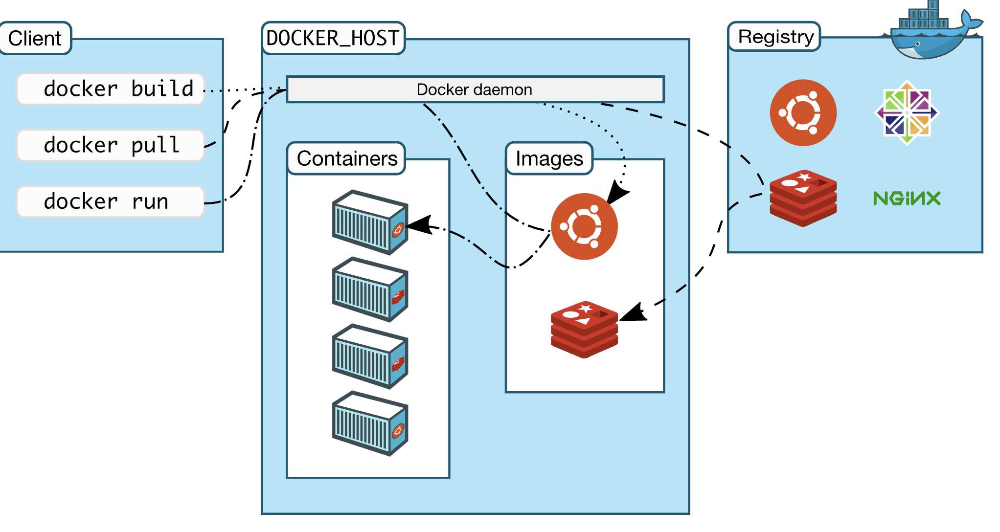

# SQL Overview and Relational DBs on Containers Practice

In this practice we will manipulate data on a Relational Database within a Docker container


### Prerequisites
* [Install docker](https://docs.docker.com/engine/install/) 
* Install a db client (i.e. [DBeaver](https://dbeaver.io/download/)) 

### What You Will Learn
- How to use a docker container of a relational database
- Docker commands
- Operative System commands and Overview
- How to connect to a Docker Container
- How to connect to a Database by using a DB client
- SQL Overview
- Transactions Overview

# Practice

You're working on a clinic, and the clinic needs a database to have records of the appointments that were made between the patient and the doctor.

The clinic only provides you a CSV file with the historical data of the appointments and they ask you to create the database from it.


### Requirements
- Develop and setup a docker container of a Relational Database by using the provided [CSV](clinic.csv) file's data
- Normalize on Third Normal Form (3NF) the Database
- Execute requested queries from the database

# Let's do it!


## Step 1

First, we are going to create a docker container with a MySQL image to create a clinic Database

Create within this folder a dockerfile with the following content:

```
FROM mysql
ENV MYSQL_ROOT_PASSWORD=mypassword
ENV MYSQL_DATABASE=mydatabase
ENV MYSQL_USER=myuser
ENV MYSQL_PASSWORD=mypassword
EXPOSE 3306
```

### Dockerfile
**A Dockerfile is a script that contains instructions for building a Docker image. A Dockerfile is used to create an image, which can then be used to create new containers. A Dockerfile typically includes instructions for setting environment variables, copying files, and running commands.**

Now build a docker image with the following command:

```
docker build -t clinic .
```

This command builds a docker image with name as **´clinic´** by using the **´-t´** flag.

Now you can see the images on your docker with following command:

```
docker images
```

### Docker Image
**A Docker image is a pre-built package that contains all the necessary files and dependencies to run an application or service. You can think of an image as a snapshot of an application or service that can be used to create new containers.**

You can find and download images from the [Docker Hub](https://hub.docker.com/search), which is a public registry of Docker images. You can also create your own images by writing a Dockerfile, which is a script that contains instructions for building an image.

Now let's create a container with the following command:

```
docker run --rm -d -p 6603:3306 --name clinic-container clinic
```

This command will create a docker container named as **´clinic-container´** from **´clinic´** image.
* The **´-d´** option runs the container in detached mode, which allows it to run in the background.
* The **-p** flag helps to publish Publish container's port(s) to the host, in this case <host-port>:<container-port>
* The **--rm** flag instructs Docker to also remove the anonymous volumes associated with the container if the container is removed

### Docker Container
**A Docker container is a running instance of a Docker image. When you start a container, Docker creates a new, isolated environment for the application or service to run in. Containers are lightweight and efficient, and you can run multiple containers on the same host.**



### Docker commands

List of common docker commands:
* **docker run** : Runs a new container from an image
* **docker ps** : Lists all running containers
* **docker stop** : Stops a running container
* **docker start** : Starts a stopped container
* **docker logs** : Shows the log output of a container
* **docker build** : Builds an image from a Dockerfile
* **docker pull** : Pulls an image or a repository from the registry
* **docker rm** : Remove one or more containers
* **docker image rm**: Remove one or more images

### Docker VS Virtual Machine

Docker containers are lightweight, portable, and self-sufficient environments that allow you to run applications in isolation from the host system. Containers are built on top of the host operating system and share the host's kernel. They are lightweight because they don't include an operating system, but instead rely on the host's kernel to provide the necessary services.

Virtual machines (VMs) are software-based systems that mimic the hardware of a physical computer. They run on top of a hypervisor, which is a software layer that sits between the VM and the host operating system. VMs are typically used to run multiple operating systems on the same host, each in its own isolated environment.


## Step 2

Now let's create a sample **´clinic_db´** within the mysql database.

First, let's connect to the docker container with the following command:

```
docker exec -it clinic-container bash
```

This command will connect to **´clinic_container´** on a bash console.

Now within docker container, with following command will connect to mysql instance:

```
mysql -u root -p
```

This command will ask you for a password and type: **mypassword**

Now let's create **´clinic_db´** on mysql with the following command:

```
create database clinic_db;
```

This command will create the database **´clinic_db´**

## Step 3

Following up, let's connect to the database by using a Database client, on this case with DBeaver.


## Step 4

Now let's check the CSV file data and create an initial definition of the database

In this case the provided [CSV](clinic.csv) file contains the following data:

```
patient_name,patient_last_name,patient_address,appointment_date,appointment_time,doctor_name,doctor_last_name,doctor_clinical_specialization
John,Doe,123 Main St,2022-01-01,10:00 AM,Jane,Smith,Pediatrics
Jane,Smith,456 Park Ave,2022-01-02,11:00 AM,Michael,Johnson,Family Medicine
Michael,Johnson,789 Elm St,2022-01-03,12:00 PM,Emily,Williams,Cardiology
Emily,Williams,321 Oak St,2022-01-04,1:00 PM,Matthew,Brown,Cardiology
Matthew,Brown,654 Pine St,2022-01-05,2:00 PM,Abigail,Jones,Dermatology
Abigail,Jones,987 Cedar St,2022-01-06,3:00 PM,Daniel,Miller,Orthopedics
```

On this case there are the following columns:

patient_name | patient_last_name | patient_address | appointment_date | appointment_time | doctor_name | doctor_last_name | doctor_clinical_specialization
--- |-------------------| --- | --- |--- |--- |--- |--- 
String | String            | String | Date | Time | String | String | String 


