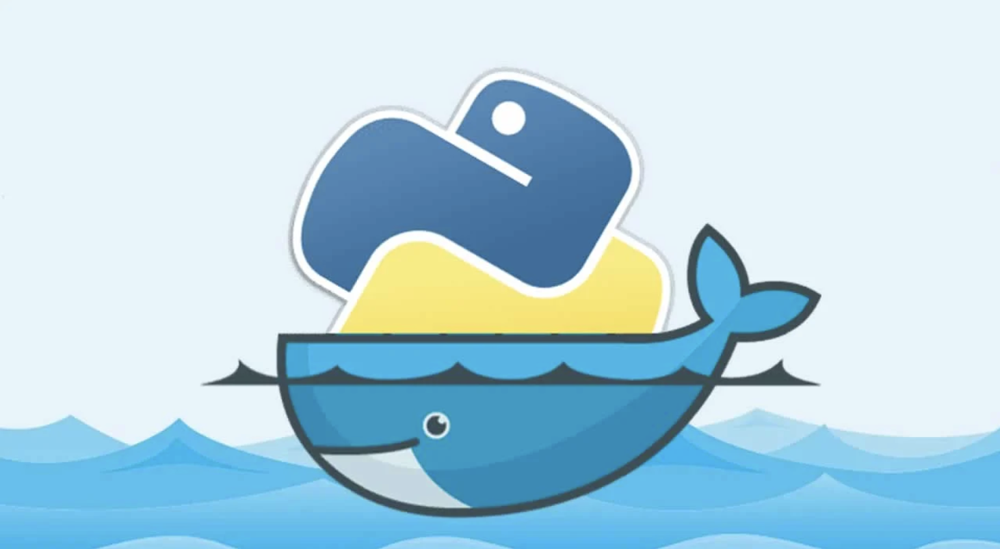
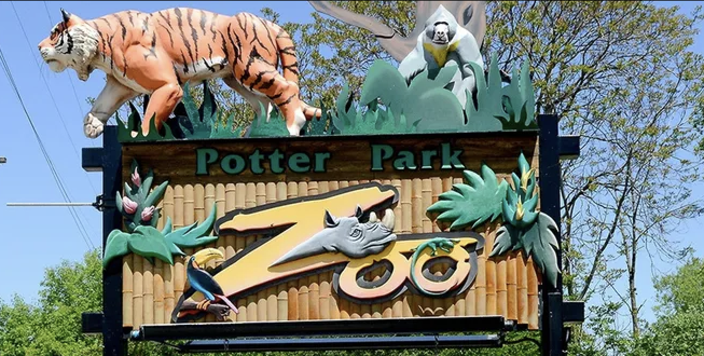
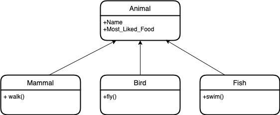
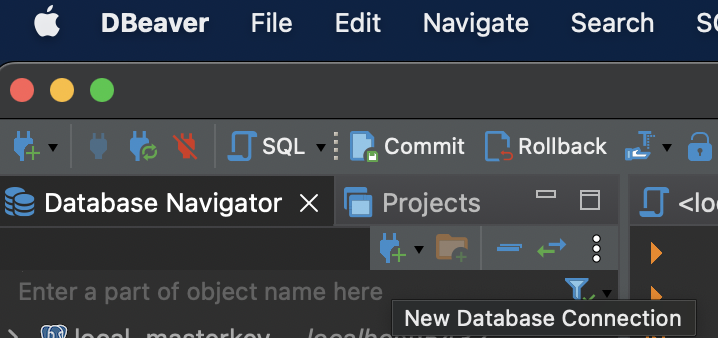
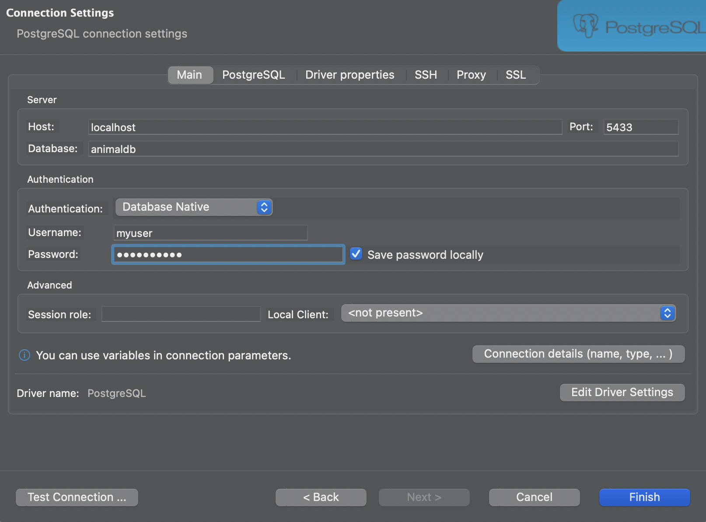
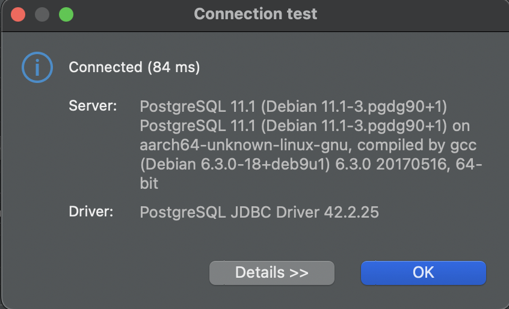
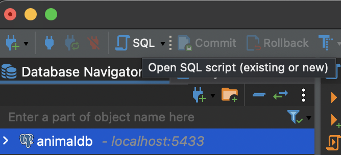
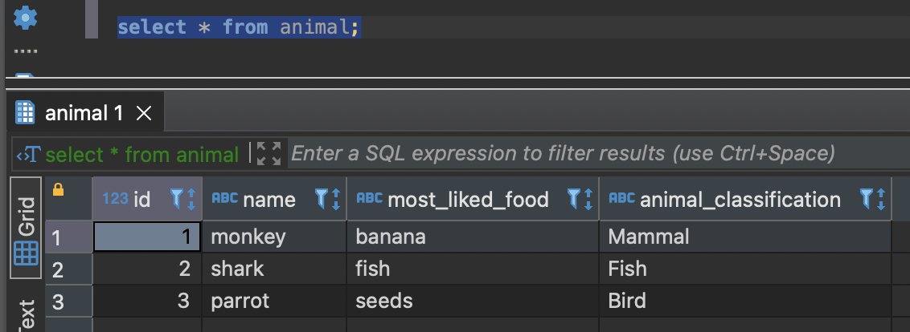

# Python Overview and Running Applications on Containers

In this practice we will develop and use a Python application running on a docker container



## Prerequisites

* [Install docker][install_docker]
* Follow the [pre-setup guideline][pre_setup])

## What You Will Learn

* How to use a docker container of a Python Application
* Docker Compose commands
* Operative System commands and Overview
* How to connect to a Docker Container
* How to connect to a Database by using a DB client
* Programming foundations
* Python Overview

## Practice

You are working on a Zoo, and the Zoo is asking you to create a software that classifies the animals of the Zoo.

This Zoo only passed you a list of the classification of the animals, and you will write a software that classifies them.

Once classification is done, store them into a database.



### Requirements

* Develop and setup a docker compose to use python on a container
* Develop classes for the following animal classification:
  * **Mammal:** lions, elephants, monkeys, bears, giraffes
  * **Bird:** parrots, eagles, flamingos, penguins, owls
  * **Fish:** sharks, rays, piranhas, clownfish, salmon
* Use Python's data to deposit on a PostgreSQL Database

### Step 1

Now let's create an initial python script to run a "hello world" program.

First let's connect to python_app service container:

```sh
docker-compose exec python_app bash
```

This command will start a bash session on the container of the python_app service.

Now let's create a hello world python application.

To do so, first, let's do following command to edit a python file:

```sh
vi main.py
```

Within **vi**, let's add following code:

```sh
print('HELLO WORLD!!')
```

Now let's exit from **vi** and run following command with:

```sh
python main.py
```

And there you go! You should see HELLO WORLD!! message on the command prompt

### Step 2

Now lets create our first python classes, in this case let's create the following classes:



To do so, lets create a directory to have all the classes on it.

First create a directory called 'animals' and move to it:

```sh
mkdir animals
cd animals
```

Once on animals directory let's create and edit animal.py classes

```sh
vi animals.py
```

On it let's add the following classes definitions:

```py
from typing import Type

class Animal:
    def __init__(self, name: str, most_liked_food: str) -> None:
        self.name = name
        self.most_liked_food = most_liked_food

    def __str__(self) -> str:
        return f'{self.name} likes {self.most_liked_food}'

    def make_sound(self) -> None:
        pass

class Mammal(Animal):
    def __init__(self, name: str, most_liked_food: str, number_of_paws: int) -> None:
        super().__init__(name, most_liked_food)
        self.number_of_paws = number_of_paws

    def walk(self) -> None:
        print(f'{self.name} walks with {self.number_of_paws} paws')

    def make_sound(self) -> None:
        print("Mammal's sound depends the animal")

class Fish(Animal):
    def __init__(self, name: str, most_liked_food: str, number_of_fins: int) -> None:
        super().__init__(name, most_liked_food)
        self.number_of_fins = number_of_fins

    def swim(self) -> None:
        print(f"{self.name} swims and has {self.number_of_fins} fins")
 
    def make_sound(self) -> None:
        print("Glu Glu")

class Bird(Animal):
    def __init__(self, name: str, most_liked_food: str, number_of_wings: int) -> None:
        super().__init__(name, most_liked_food)
        self.number_of_wings = number_of_wings

    def fly(self) -> None:
        print(f"{self.name} flies and has {self.number_of_wings} wings")
 
    def make_sound(self) -> None:
        print("Chirp chirp")
```

now, to be easily imported, let's do a **init**.py file to import the classes, to do, let's edit with following command:

```sh
vi __init__.py
```

and add the following imports:

```py
from .animals import Animal
from .animals import Mammal
from .animals import Fish
from .animals import Bird
```

These imports will facilitate the access of the classes by referring only the parent directory name, in this case "animals"

### Step 3

Now let's use the created classes on main.py

Let's go to our /app directory with:

```sh
cd /app
```

Now let's edit main.py with following command:

```sh
vi main.py
```

And on it, let's use following code:

```py
from animals import Animal, Mammal, Fish, Bird

print("let's create a Mammal")
mammal = Mammal('monkey','banana',2)
print(mammal)
mammal.walk()
mammal.make_sound()

print("let's create a Fish")
fish = Fish('shark','fish',1)
print(fish)
fish.swim()
fish.make_sound()

print("let's create a bird")
bird = Bird('parrot','seeds',2)
print(bird)
bird.fly()
bird.make_sound()
```

On this code, you are able to instantiate a mammal (monkey), a fish (dolphin), and a bird (parrot).

Now let's exit from editor and run following command to run the application:

```sh
python main.py
```

### Step 4

Now let's connect to PostgreSQL using DBeaver to create animal table

First let's open [DBeaver](https://dbeaver.io/download/) IDE and click on the New Database Connection Icon that is on the upper left of the IDE:



Then a pop up window will open and here selects **´PostgreSQL´** option and click on **Next**


Then on connection parameters use the following:

* Server Host: **localhost**
* Port: **5433**
* Database: **animaldb**
* Username: **myuser**
* Password: **mypassword**



Now click on Test connection and should appear as **´Connected´**



Once done, now let's open a sql script by using this connection by clicking **´SQL´** button that is on the upper left part of the menu



Now, let's create the animal table by writing and executing the following create table on the SQL script editor:

```sql
create table animal(
 id serial primary key,
 name varchar(50),
 most_liked_food varchar(50),
 animal_classification varchar(50)
);
```


### Step 5

Now we are going to Re-edit the file to insert animal data into database.

To do so, let's re-edit main.py file with following content:

```py
import psycopg2
from typing import Type
from animals import Animal, Mammal, Fish, Bird

# Define the connection parameters
conn_params = {
    "host": "postgres_db",
    "port": 5432,
    "database": "animaldb",
    "user": "myuser",
    "password": "mypassword"
}

# Connect to the database
conn = psycopg2.connect(**conn_params)
cur = conn.cursor()

# Define the SQL insert statement
sql = "INSERT INTO animal (name, most_liked_food, animal_classification) VALUES (%s, %s, %s)"

# Define a list of animals to insert
animals = [Mammal('monkey', 'banana', 4),
           Fish('shark', 'fish', 2),
           Bird('parrot', 'seeds', 2)]

# Loop through the animals and insert them into the database
for animal in animals:
    # Get the animal's classification based on its type
    classification = animal.__class__.__name__
    # Execute the SQL insert statement
    cur.execute(sql, (animal.name, animal.most_liked_food, classification))

# Commit the changes and close the connection
conn.commit()
cur.close()
conn.close()

print("Animals were inserted into Database")
```

### Step 6

Check Animal table on DB on dbeaver by running following query:

```sql
select * from animal;
```



## HOMEWORK TIME

On past main.py script we declared on conn_params variable the postgredb connection parameters on the code. But this is a BAD PRACTICE.

For Homework, let's do the following:

UPDATE main.py to grab the connection parameter values from ENV VARIABLES, let's say you are setting on the python_app container the following ENV VARIABLES:

* POSTGRE_HOST: **postgres_db**
* POSTGRE_PORT: **5432**
* POSTGRE_DB: **animaldb**
* POSTGRE_USER: **myuser**
* POSTGRE_PASSWORD: **mypassword**

Assume you set above ENV VARIABLES, and UPDATE main.py to use them while connecting to DB rather than the hard coded values that are on conn_params

## Conclusion

By following this tutorial, you should now have a development environment set up using Docker Compose with Python and PostgreSQL containers. Your Python application should be able to connect to the PostgreSQL container and perform operations on the data stored in it. You can continue to develop your application and use the docker-compose commands to manage your containers.

## Still curious

>Do you want to know what is your Python level?
>
>Can you identify with these descriptions?

### Beginner

* You are able to program and debug your own code, you usually try random changes until one finally works.
* It's very likely you may have used python previously but just for scripts or as part of another tool.

How do I improve?

* Get a python Course
* Learn to read [documentation][python docs]

### Intermediate

* You immediately recognizes the need for a function or procedure, as opposed to just code.
* You have already done this practice previously but with another database
* You use virtual environments with ease and know the difference between pyenv, pyvenv...

How do I improve?

* How many coding principles do you know?
* Have you ever heard about the PEP guidelines?
* Go deep into [documentation][python docs], maybe there are new features you are still not using

### Advanced

* You regularly use map, sort, filter functions...
* You know the difference between a set, map, array and the impact of using one structure over the other.
* You probably are the one doing interviews for new hiring in your area
* You probably are the one that does the setup for initial python projects

How do I improve?

* Go for the CI/CD area
* Take a course on the Architect side

## Links

* [Pre Setup][pre_setup]
* [Install Docker][install_docker]
* [documentation][python docs]

[pre_setup]: pre-setup%20README.md

[install_docker]: https://docs.docker.com/engine/install/
[python docs]: https://docs.python.org/3/tutorial/index.html
