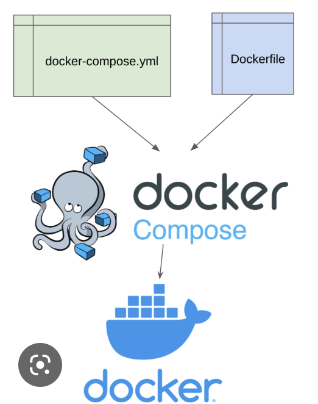
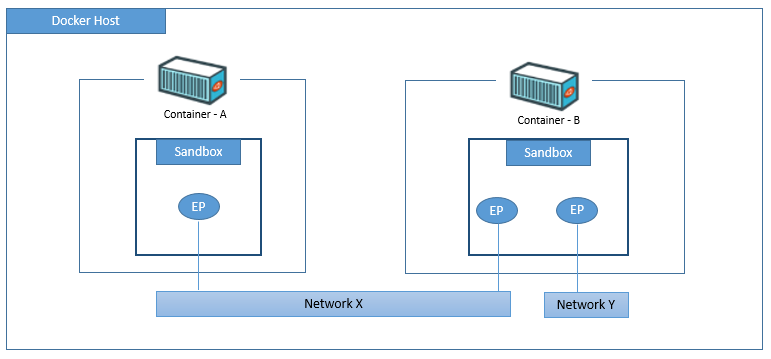

# Python Overview and Running Applications on Containers

In this practice we will develop and use a Python application running on a docker container


### Prerequisites
* [Install docker](https://docs.docker.com/engine/install/) 

### What You Will Learn
- How to use a docker container of a Python Application
- Docker Compose commands
- Operative System commands and Overview
- How to connect to a Docker Container
- How to connect to a Database by using a DB client
- Programming foundations
- Python Overview

# Practice

You are working on a Zoo, and the Zoo is asking you to create a software that classifies the animals of the Zoo.

This Zoo only passed you a list of the classification of the animals, and you will write a software that classifies them.

Once classification is done, store them into a database.


### Requirements
* Develop and setup a docker compose to use python on a container
* Develop classes for the following animal classification:
  * **Mammal:** lions, elephants, monkeys, bears, giraffes
  * **Bird:** parrots, eagles, flamingos, penguins, owls
  * **Fish:** sharks, rays, piranhas, clownfish, salmon
* Use Python's data to deposit on a PostgreSQL Database

# Let's do it!


## Step 1

### Docker compose
**Docker Compose is a tool for defining and running multi-container Docker applications. It allows you to configure your application's services, networks, and volumes in a single docker-compose.yml file, and then start and stop them using a single command.**



First, we are going to create a docker-compose.yml file with the configuration for a python and postgreSQL container

```
version: '3'
services:
  postgres_db:
    image: postgres:11.1
    environment:
      POSTGRES_PASSWORD: mypassword
      POSTGRES_DB: animaldb
      POSTGRES_USER: myuser
    ports:
      - 5433:5432
    networks:
      - app-tier
    volumes:
      - ./postgres:/docker-entrypoint-initdb.d

  python_app:
    build:
      context: .
      dockerfile: Dockerfile
    depends_on:
      - postgres_db
    networks:
      - app-tier
    command:
      tail -f /dev/null

networks:
  app-tier:
    driver: bridge
```


This is a docker-compose.yml file that is used to define and run multi-container applications using Docker Compose.

* The first line specifies the version of the Docker Compose file format.

* Under **services**, two services are defined: **postgres_db** and **python_app**.

* The **postgres_db** service uses the **postgres:11.1** image, which is a version of the official PostgreSQL image from Docker Hub with version 11.1.
It has an environment variable block, which sets the values for the POSTGRES_PASSWORD, POSTGRES_DB and POSTGRES_USER environment variables.

* The ports block maps the container's port **5432** to the host's port **5433**, allowing external connections to the PostgreSQL service.

* The **networks** block links the container to the **app-tier** network.

* The **volumes** block creates a mount point to the host's **./postgres** directory and maps it to **/docker-entrypoint-initdb.d** directory in the container. This allows any files in the **./postgres** directory on the host to be accessible inside the container.


* The **python_app** service is configured to build the container using the "Dockerfile" in the current directory and the context is set to the current directory (.)

* **depends_on** block is used to specify that the **python_app** container should be started after the **postgres_db** container.

* **networks** block links the container to the **app-tier** network.

* **command** block is used to specify a command that should be run when the container starts. Here is it runs **tail -f /dev/null** command.

* Under **networks**, the app-tier network is defined using the bridge driver. This network allows containers to communicate with each other using their hostnames.



**Overall, this file creates two services, postgres_db and python_app. postgres_db service runs postgres:11.1 image and python_app service runs an image built from a Dockerfile in the current directory. These services are connected to the same network and python_app is dependent on postgres_db service.**


Now let's create a Dockerfile for our python_app container:

```
# Use the official Python 3.10 image as the base image
FROM python:3.10

# Set the working directory in the container
WORKDIR /app

# Copy the requirements file into the container
COPY requirements.txt .

# Install the necessary dependencies
RUN pip install --no-cache-dir -r requirements.txt

# Update OS libraries and install VI editor
RUN apt-get update && apt-get install -y vim

# Default command that is triggered when container starts
CMD ["tail", "-f", "/dev/null"]
```

Above Dockerfile is having the following:
* **FROM** is used to specify the base image for the Dockerfile. In this case, the official Python 3.10 image is used as the base.
* **WORKDIR** is used to set the working directory for the rest of the instructions in the Dockerfile. In this case, the working directory is set to /app.
* **COPY** is used to copy files and directories from the host machine to the container. In this case, the requirements.txt file is copied to the /app directory.
* **RUN** is used to execute commands in the container. In this case, pip install is run to install the dependencies listed in requirements.txt
* **CMD** is used to specify the command that should be run when the container starts. In this case, the tail command is used to display the last lines of a file and the -f option is used to keep the command running and display new lines as they are added to the file. By using tail -f /dev/null you are not looking at any file but it keeps running


Now let's create the requirements.txt with following content:

```
psycopg2==2.9.5
```

psycopg2 is a PostgreSQL library for Python. It is used to connect to, query and manage a PostgreSQL database from a Python script.

Now let's run the containers with following docker compose command:

```
docker-compose up -d
```

This command will pull the required images, create the containers, and start them in detached mode.

Now let's see the running containers with following docker-compose command:

```
docker-compose ps
```

## Step 2

Now let's create an initial python script to run a "hello world" program.

First let's connect to python_app service container:

```
docker-compose exec python_app bash
```

This command will start a bash session on the container of the python_app service.

Now let's create a hello world python application.

To do so, first, let's do following command to edit a python file:

```
vi main.py
```

Within **vi**, let's add following code:

```
print('HELLO WORLD!!')
```

Now let's exit from **vi** and run following command with:

```
python main.py
```

And there you go! You should see HELLO WORLD!! message on the command prompt


## Step 3

Now lets create our first python classes, in this case let's create the following classes:


To do so, lets create a directory to have all the classes on it.

First create a directory called 'animals' and move to it:

```
$ mkdir animals
$ cd animals
```

Once on animals directory let's create and edit animal.py classes

```
vi animals.py
```

On it let's add the following classes definitions:

```
from typing import Type

class Animal:
    def __init__(self, name: str, most_liked_food: str) -> None:
        self.name = name
        self.most_liked_food = most_liked_food

    def __str__(self) -> str:
        return f'{self.name} likes {self.most_liked_food}'

    def make_sound(self) -> None:
        pass

class Mammal(Animal):
    def __init__(self, name: str, most_liked_food: str, number_of_paws: int) -> None:
        super().__init__(name, most_liked_food)
        self.number_of_paws = number_of_paws

    def walk(self) -> None:
        print(f'{self.name} walks with {self.number_of_paws} paws')

    def make_sound(self) -> None:
        print("Mammal's sound depends the animal")

class Fish(Animal):
    def __init__(self, name: str, most_liked_food: str, number_of_fins: int) -> None:
        super().__init__(name, most_liked_food)
        self.number_of_fins = number_of_fins

    def swim(self) -> None:
        print(f"{self.name} swims and has {self.number_of_fins} fins")
 
    def make_sound(self) -> None:
        print("Glu Glu")

class Bird(Animal):
    def __init__(self, name: str, most_liked_food: str, number_of_wings: int) -> None:
        super().__init__(name, most_liked_food)
        self.number_of_wings = number_of_wings

    def fly(self) -> None:
        print(f"{self.name} flies and has {self.number_of_wings} wings")
 
    def make_sound(self) -> None:
        print("Chirp chirp")
```

now, to be easily imported, let's do a __init__.py file to import the classes, to do, let's edit with following command:

```
vi __init__.py
```

and add the following imports:

```
from .animals import Animal
from .animals import Mammal
from .animals import Fish
from .animals import Bird
```

These imports will facilitate the access of the classes by referring only the parent directory name, in this case "animals"


## Step 4

Now let's use the created classes on main.py

Let's go to our /app directory with:

```
cd /app
```

Now let's edit main.py with following command:

```
vi main.py
```

And on it, let's use following code:

```
from animals import Animal, Mammal, Fish, Bird

print("let's create a Mammal")
monkey = Mammal('monkey','banana',2)
print(monkey)
monkey.walk()
monkey.make_sound()

print("let's create a Fish")
fish = Fish('dolphin','fish',1)
print(fish)
fish.swim()
fish.make_sound()

print("let's create a bird")
bird = Bird('parrot','seeds',2)
print(bird)
bird.fly()
bird.make_sound()
```

On this code, you are able to instantiate a mammal (monkey), a fish (dolphin), and a bird (parrot).

Now let's exit from editor and run following command to run the application:

```
python main.py
```

## Step 5

Connect to PostgreSQL using DBeaver to create Animal table

## Step 6

Re-edit the file to insert animal data into database

## Step 7

Check Animal table on DB

# Conclusion

By following this tutorial, you should now have a development environment set up using Docker Compose with Python and PostgreSQL containers. Your Python application should be able to connect to the PostgreSQL container and perform operations on the data stored in it. You can continue to develop your application and use the docker-compose commands to manage your containers.
