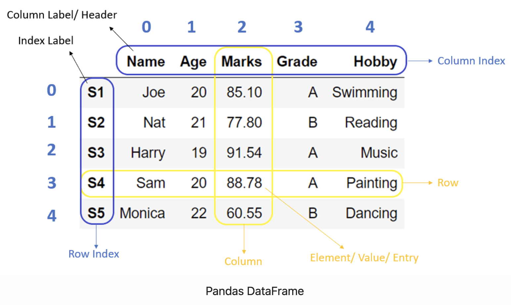

# Python for Data Engineering

In this practice we will develop and use a Python script to process data by using Data Engineering libraries such as Numpy and Pandas


### Prerequisites
* [Install Python on local machine](https://www.python.org/downloads/) 

### What You Will Learn
- Process data on a Python Script
- Usage of Numpy Library
- Usage of Pandas Library

# Practice

You are working on a Census Company, and they asking you to provide insights of the census data made on the population.

The company provides you a census data on csv file and they requested you to gather statistics and information from it.


### Requirements
* Create a Python Script to process the csv file which contains following census data from people:
  * **age:** Age of the person.
  * **workclass:** Private, Self-emp-not-inc, Self-emp-inc, Federal-gov, Local-gov, State-gov, Without-pay, Never-worked.
  * **education:** Bachelors, Some-college, 11th, HS-grad, Prof-school, Assoc-acdm, Assoc-voc, 9th, 7th-8th, 12th, Masters, 1st-4th, 10th, Doctorate, 5th-6th, Preschool.
  * **marital-status:** Married-civ-spouse, Divorced, Never-married, Separated, Widowed, Married-spouse-absent, Married-AF-spouse.
  * **occupation:** Tech-support, Craft-repair, Other-service, Sales, Exec-managerial, Prof-specialty, Handlers-cleaners, Machine-op-inspct, Adm-clerical, Farming-fishing, Transport-moving, Priv-house-serv, Protective-serv, Armed-Forces.
  * **relationship:** Wife, Own-child, Husband, Not-in-family, Other-relative, Unmarried.
  * **race:** White, Asian-Pac-Islander, Amer-Indian-Eskimo, Other, Black.
  * **sex:** Female, Male.
  * **hours-per-week:** Weekly working hours.
  * **native-country:** United-States, Cambodia, England, Puerto-Rico, Canada, Germany, Outlying-US(Guam-USVI-etc), India, Japan, Greece, South, China, Cuba, Iran, Honduras, Philippines, Italy, Poland, Jamaica, Vietnam, Mexico, Portugal, Ireland, France, Dominican-Republic, Laos, Ecuador, Taiwan, Haiti, Columbia, Hungary, Guatemala, Nicaragua, Scotland, Thailand, Yugoslavia, El-Salvador, Trinadad&Tobago, Peru, Hong, Holand-Netherlands.
  * **salary:** >50K,<=50K
* Obtain requested information of the steps when processing the file

# Let's do it!


## Step 1

### Python Virtual Environment
**A virtual environment is a self-contained Python environment that allows you to install and run packages separately from your main Python installation. This is especially useful for projects that have different package requirements.**


First, we are going to set up a virtual environment in Python, you will need to use the following commands:

```
python -m venv myenv
source myenv/bin/activate
```

* **'python -m venv myenv'** - This command creates a virtual environment with the name "myenv" using the venv module in Python. A virtual environment allows you to isolate the dependencies for your project from the rest of your system, making it easier to manage different versions of libraries for different projects.

* **'source myenv/bin/activate'** - This command activates the virtual environment "myenv". When a virtual environment is activated, any packages you install using pip will be installed in that environment, rather than in your system Python installation. This helps ensure that your project has access to the correct version of libraries, without affecting other projects that may have different requirements.

## Step 2

Now let's install numpy and pandas libraries with following command:

```
pip install numpy pandas
```

### Numpy
**NumPy is a library for the Python programming language that provides support for arrays and matrices. It is a fundamental library for scientific computing with Python, including support for a wide variety of mathematical and statistical operations. The main feature of NumPy is its N-dimensional array object, which allows you to perform operations on arrays of any size and shape, including element-wise operations, matrix multiplication, and basic linear algebra.**


### Pandas
**pandas is a library for the Python programming language that provides data structures and functions needed for data analysis and data manipulation. It is particularly well-suited for working with labeled, tabular data in a way that is intuitive and easy to understand. The main data structure in pandas is the DataFrame, which is a two-dimensional table with labeled rows and columns. With pandas, you can perform operations on the data, such as filtering, grouping, aggregating, and transforming, with ease. Additionally, pandas provides built-in support for working with data from a variety of sources, including CSV, Excel, SQL databases, and more.**




## Step 3
### Numpy Arrays
Numpy arrays are a powerful data structure in Numpy that allows you to perform mathematical operations on large datasets efficiently. The basic syntax for creating a Numpy array is as follows:

```
import numpy as np
a = np.array([1, 2, 3, 4])
```

## Step 4
### Reading Data
We will use the CSV data source. To read in this data, we will use the pandas library. The code to read in the data and store it in a Pandas dataframe:

```
import pandas as pd

df = pd.read_csv('data.csv')
```

## Step 5
### Pandas Dataframes

Pandas dataframes are a two-dimensional data structure that allows you to store and manipulate tabular data. A dataframe can be created from a Numpy array using the following code:

```
df = pd.DataFrame({'A': a})
```

## Step 6
### Performing Transformations
Once you have your data stored in a Numpy array or Pandas dataframe, you can perform various transformations on that data. For example, you can apply mathematical operations to Numpy arrays, or perform group-by operations on Pandas dataframes.

One important method to note is the apply() method in Pandas, which allows you to apply a function to each element in a dataframe. For example:

```
df['B'] = df['A'].apply(lambda x: x * 2)
```
This code will create a new column B in the dataframe, which is equal to A multiplied by 2.

## Step 7
### Running script
Run the census python script that process census information with following command:
```
python census.py
```
This script assumes that the CSV file is named data.csv and is in the same directory as the script. The script performs the following transformations on the data:

Loads the data from the CSV file into a pandas dataframe.
Calculates the average age, occupation count, and average hours per week.
Determines the maximum salary.
Groups the data by occupation and salary and finds the occupation with the highest and lowest salary.

# Conclusion

This course has covered the basics of Numpy and Pandas, including setting up a virtual environment, reading in data, and performing transformations on that data. With these tools and techniques, you can begin working with large datasets and performing data analysis in Python.