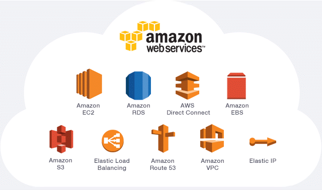
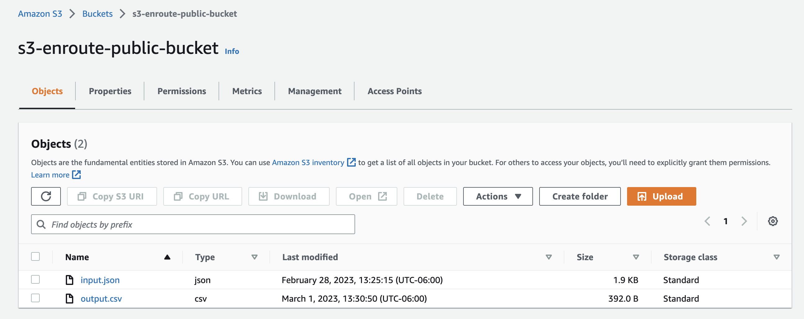

# Airflow and Cloud Introduction

In this practice we will develop a simple ETL pipeline on Airflow and will connect to AWS S3 (AWS Storage) cloud.


## Prerequisites

* Follow the [pre-setup guideline][pre-setup]

## Before start

Let's review some concepts we will be using during this lesson:

### Cloud computing

Cloud computing is the delivery of on-demand computing resources, such as servers, storage, databases, software, and analytics, over the internet.

>Rather than owning and maintaining physical servers and infrastructure, users can access these resources from cloud service providers.

In this course we will be using AWS, GCP and Azure, but for this specific lesson we will be using Amazon Web Services (AWS)

### Amazon Web Services (AWS)

AWS is a the cloud provided by Amazon.com, the services it offers can help you build, deploy and manage your infrastructure and their applications.

Let's review some AWS concepts:

* `AWS Regions` \
  Where your application will be hosted/using resources, they have codenames (us-east-1, us-west-1, eu-west-1...)
* `AWS Availability Zones` \
  Each region is composed of 1 or more Availability zones, the idea is that if one fails, the other can be still up.
* `IAM (Identity and Access Management)` \
  This will allow you to manage security; Permission, policies, roles, users...
  * `IAM User`: Represents a person or an application that needs to access AWS resources
  * `AWS Roles`: AWS roles are entities that you can create in IAM to define a set of permissions for a specific task or job function.
  * `IAM Policies`: They specify which AWS resources can be accessed and what actions can be taken on those resources.
* `RDS (Relational Database Service)` \
  Cloud relational data, some flavors you can pick are: MySQL, PostgreSQL, and Oracle.
* `CloudWatch` \
  Log collection, monitoring and audit service.
* `DynamoDB` \
  Non-relational database, you can still use mongo or similar if you do the wiring as a custom service, but out of the box this is the one.
* `EC2 (Elastic Compute Cloud)` \
  Virtual machine service, if you have something dockerized just upload the image and select the output ports.
* `S3 (Simple Storage Service)` \
  This will be your File system for almost everything, even if you upload an image to the container registry for EC2 it will still use S3 in the backend.
* `VPC (Virtual Private Cloud)` \
  This will create a connection between your services, so you don't need to worry for interconecction security such as firewalls in your app components. You can customize this as much as you want with routing tables...
* `AWS CLI` \
  AWS CLI is a command-line tool that enables you to interact with AWS services using commands in your terminal or shell.
* `AWS Console` \
  The AWS console is a web-based user interface that allows users to interact with AWS services and manage their AWS resources.

  

## What You Will Learn

* Airflow Components
* Airflow DAGs
* Cloud Concepts
* AWS Concepts

## Practice

Suppose you are working on an Ad Company that process data from the users to then know what is the best suitable ad to give them when they are navigating on the internet.

The company is receiving JSON files from the user events and those are stored on S3, and they want you to transform them to CSV format at S3 because later they want to load it into a Database.


### Requirements

Using the infrastructure from setup from the [pre-setup][pre-setup] and AWS credentials to:

* Setup a public bucket with the input json file
  * *Follow on the instructor screen*
* Setup a hook with your AWS credentials
* Create an ETL process
  * Read the input file from S3
  * Create a new dataframe with the following columns
    * `user_id`
    * `x_coordinate`
    * `y_coordinate`
    * `date`
  * Save the transformed data frame as CSV into S3 as `output.csv`

>DO NOT STORE CREDENTIALS ON THE REPOSITORY \
>The AWS credentials will be provided by the instructor
>
>*Those credentials will contain permission to `read`/`write` on `s3 buckets` \
>*You will be provided with both `User/Password` and `CLI` (Access/Secret Key)

### Step 1 - S3 Bucket

>Before we start: Be aware of the security implications of creating a public S3 bucket, as anyone on the internet will be able to access the files in the bucket.
>
>Since we only need 1 bucket for the whole class, follow these steps on the professor screen

Setup a public bucket with the input json file:

* Log in to the `AWS Management Console`
* Navigate to the `S3`
  * Search `S3`
  * Select the service from the list
* Click on `Create Bucket` with the name `de-101-session-6`
  * During the creation process, choose `Public` for the bucket access control.
* After the bucket is created, go to the Permissions tab and select `Bucket Policy`
  * Enter a policy that grants public read access to the bucket
* Drag and drop the input file to the S3 bucket
* Verify the file is there

### Step 2 - Airflow UI Hook

* `Hook` \
  A Hook is a high-level interface to an external platform that lets you quickly and easily talk to them without having to write low-level code that hits their API or uses special libraries. \
  They integrate with Connections to gather credentials, and many have a default conn_id; for example, the PostgresHook automatically looks for the Connection with a conn_id of postgres_default if you don’t pass one in.

* `Connection` \
  A Connection is essentially set of parameters - such as username, password and hostname - along with the type of system that it connects to, and a unique name, called the `conn_id`.

For this step we will setup a hook for later use in code

* Open `Airflow WebUI`
  * Login
* From the top menu click `Admin`
* Select `Connections`
* Clic `+` icon to add a new record
* Create a new connection with the following parameters
  * `Connection Id`: (`conn_id`) the name of your connection \
    Recommended `aws_conn`
  * `Connection Type`: `Amazon Web Services`
  * `AWS Access Key ID`: The value provided by the professor \
    In this example we will use `ABC` for screenshots
  * `AWS Secret Access Key`: The value provided by the professor \
    In this example we will use `DEF` for screenshots
* Clic `Test` \
  A green banner should be displayed
* Clic `Save` \
  A green banner should be displayed and the new connection will be added to the list

### Step 3 - ETL with Hooks

We will use the file in the dags as template:

#### Step 2.1 - Read

Read the input file from S3

* Declare the constant of the connection hook

  ```py
  AWS_CONN_ID = 'aws_conn'
  ```

* Add a function that will do the work \
  This function will receive some parameters:
  * `bucket`: The bucket we declare on previous Step
  * `bucket_file`: The input file inside the bucket

  ```py
  def json_to_csv(bucket, bucket_file):
    pass # Temporary until we have some code
  ```

* Declare the DAG and the dependency trigger (add related import)

  ```py
  from airflow.operators.python import PythonOperator

  ...

  with DAG('etl_s3', default_args=default_args, schedule_interval=timedelta(days=1)) as dag:
    etl_task = PythonOperator(
      task_id='etl',
      python_callable=json_to_csv,
      op_kwargs={
          'bucket': 'de-101-session-6',
          'bucket_file': 'input.json'
      }
    )

  etl_task
  ```

* Connect the hook (add related import)\

  ```py
  from airflow.providers.amazon.aws.hooks.s3 import S3Hook

  ...

  def json_to_csv(bucket, bucket_file):
    print("Connecting to S3")
    hook = S3Hook(aws_conn_id=AWS_CONN_ID)
    print("Airflow S3Hook connected to S3")
  ```

* Read the json from S3 (add related import)

  ```py
  import json

  ...

  def json_to_csv(bucket, bucket_file):
    ...
    input_json = hook.read_key(bucket_file, bucket)
    print(input_json)
  ```

Execute the DAG and check the logs to ensure it's working

>Notes:
>
>* The reason why we are instantiating the hook everytime is because we can change the connection properties and the function still work with a different host; the conn_id still will be the same, so we asume that's a constant
>* The reason why we are putting parameters intop the function is because if required, we can choose `Run DAG w/config` that will allow us to run with different files

#### Step 2.2 Transform

Create a new dataframe with the following columns: `user_id`, `x_coordinate`, `y_coordinate`, `date`

* Convert the JSON to a CSV string \
  We could use dataframes, but to keep it simple let's create a string

  ```py
  # Convert the JSON data to CSV format
  data = json.loads(input_json)
  ```

* Iterate over the rows in `data` to filter columns

  ```py
  csv_string = 'user_id, x_coordinate, y_coordinate, date\n' # csv headers
  for row in data:
    csv_string += f'{row["user_id"]}, {row["x_coordinate"]}, {row["y_coordinate"]}, {row["date"]}\n'
  print(csv_string)
  ```

Execute the DAG and check the logs to ensure it's working

#### Step 2.3 S3 Output

Save the transformed data frame as CSV into S3 as `output.csv`

* Convert the CSV string to an S3 file \
  Use your name un kebab-case as prefix

  ```py
  print("Writing CSV to S3")
  # Write the CSV data back to S3
  hook.load_string(
    csv_string,
    key="enrique-garcia-output.csv",
    bucket_name=bucket,
    replace=True
  )
  print("CSV was written to S3")
  ```

Execute the DAG and check the logs to ensure it's working

### Step 3 - Results

Review the S3 Bucket and check that `output.csv` is on the bucket:



## Homework

Modify the code, to have 3 tasks instead of 1 task, the tasks will be the following:

* `extract_data`
  * Parameters
    * `bucket`: S3 bucket name
    * `bucket_file`: File path from the bucket
  * Read json file from S3 hook and save the file to docker storage
  * Return `json_local` as the path from extracted json from s3
* `transform_data`
  * Parameters: `json_local` from `extract_data`
  * Transforms the JSON string into CSV string
  * Save the result as csv file to docker storage
  * Return `csv_local`
* `load_data`
  * Parameters
    * `json_local` from `extract_data`
    * `csv_local` from `transform_data`
    * `bucket`: S3 bucket name to write
    * `bucket_file`: File path from the bucket to write
  * Save the csv to S3 storage (`your-name-output.csv`)

And the DAG flow should be: `extract_data >> transform_data >> load_data`

## Conclusion

We just explore the powerful capabilities of `Apache Airflow` and the `AWS Cloud`.

Now you have some hands-on experience in combining the power of Apache Airflow and cloud computing to build data processing pipelines.

## Still curious

S3 is behind scenes probably the most used service for everyone, on the backend this storage is used for databases, lambda temporary code, docker registry...

*Article: [S3 architecture][aws_s3]
*Article [How S3 buckets work][s3_bucket]

## Links

### Used during this session

* [Pre-Setup][pre-setup]

* [S3 architecture][aws_s3]
* [How S3 buckets work][s3_bucket]

### Session reinforment and homework help

* [Connections & Hooks][connections_n_hooks]

[pre-setup]: ./pre-setup.md

[aws_s3]: https://saturncloud.io/blog/what-is-amazon-s3-architecture-and-how-it-works/
[s3_bucket]: https://www.whatsupgold.com/blog/understanding-how-aws-s3-buckets-work

[connections_n_hooks]: https://airflow.apache.org/docs/apache-airflow/stable/authoring-and-scheduling/connections.html
