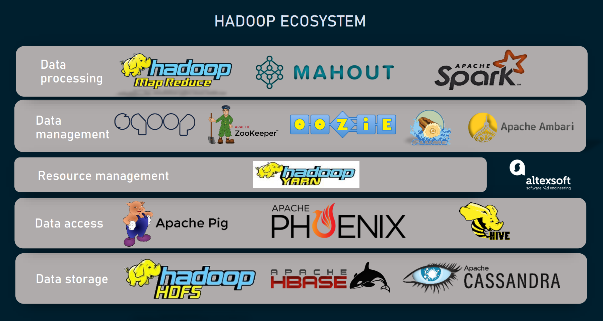

# Hadoop Ecosystem

In this practice we will learn about Hadoop and how is integrated on Data Engineering environment.


### Prerequisites
* [Install docker](https://docs.docker.com/engine/install/)

### What You Will Learn
- Hadoop Ecosystem
- Map Reduce

# Practice

This will be a walkthrough to learn Hadoop Ecosystem and HDFS by processing files on Hadoop's Map Reduce


### Requirements
* Process HDFS files to use a Map Reduce Operation job on them.

## 1. Step 1

### Hadoop

Hadoop is an open-source framework built on Java and was designed for distributed storage and processing of large data sets across clusters of commodity computers.


### Hadoop Ecosystem

The Hadoop ecosystem is a collection of tools and technologies built on top of Hadoop that extend its functionality to provide a more comprehensive data processing and analytics platform. Some of the popular components of the Hadoop ecosystem include:

+ **Apache Hive**: A data warehouse system that allows you to query and analyze large datasets stored in Hadoop using a SQL-like language.
+ **Apache Pig**: A high-level scripting language that enables developers to create complex data transformations for Hadoop.
+ **Apache Spark**: A fast and flexible processing engine that can handle batch, streaming, and interactive workloads.
+ **Apache HBase**: A NoSQL database that provides real-time read/write access to Hadoop data.
+ **Apache Storm**: A real-time stream processing system that can process large volumes of data in real-time.
+ **HDFS (Hadoop Distributed File System)**: A distributed file system that provides a way to store and access large amounts of data across a cluster of computers.



Download images required for setting up HDFS and spin up necessary containers:
```
  docker-compose up -d
```

Now, to have a look at your current running Docker containers, use the command to list all active containers:

```
# List all the available running docker containers.
docker-compose ps
```
### Copy necessary JAR and Input files

Now we need to copy the jar files which contains our map-reduce jobs and copy them inside the namenode (which will be running your jobs) in HDFS using the following Docker commands:

```
# Copy the Word Count with the Map Reduce instructions to the container
docker cp submit/WordCount.jar hadoop_namenode:/tmp/

# Copy the file in order to use it with Word Count program
docker cp submit/my_input.txt hadoop_namenode:/tmp/
```

## 2. Interact with the namenode

Enter inside namenode and open bash:
```
docker-compose exec namenode bash
```

Once you enter the name node in an interactive terminal, use
the following HDFS commands to interact with the namenode:
```
# Move to /tmp directory
cd /tmp

# HDFS list commands to show all the directories in root "/"
hdfs dfs -ls /

# Create a new directory inside HDFS using mkdir tag.
hdfs dfs -mkdir -p /user/root

# Copy the files to the input path in HDFS.
hdfs dfs -put my_input.txt /user/root 

# Have a look at the content of your input file.
hdfs dfs -cat /user/root/my_input.txt
```

## 3. Run Hadoop Map Reduce Jobs
Now you can run your map-reduce job using the following command:
```
## Run map reduce job from the path where you have the jar file.
hadoop jar WordCount.jar org.apache.hadoop.examples.WordCount input my_output
```

## 4. Check Your Output

Once the job is executed successfully, you can check your output using the cat command in HDFS:
```
# Check the content of the output file after running the job
hdfs dfs -cat my_output/*
```

You can access the HDFS namenode’s UI dashboard on your localhost at port 9870. Use the following link:
```
http://localhost:9870
```


## Notes
`docker-compose` creates a docker network that can be found by running `docker network list`, e.g. `docker-hadoop_default`.

Run `docker network inspect` on the network (e.g. `docker-hadoop_default`) to find the IP the hadoop interfaces are published on. Access these interfaces with the following URLs:

* Namenode: http://<dockerhadoop_IP_address>:9870/dfshealth.html#tab-overview
* History server: http://<dockerhadoop_IP_address>:8188/applicationhistory
* Datanode: http://<dockerhadoop_IP_address>:9864/
* Nodemanager: http://<dockerhadoop_IP_address>:8042/node
* Resource manager: http://<dockerhadoop_IP_address>:8088/

## Configure Environment Variables

The configuration parameters can be specified in the hadoop.env file or as environmental variables for specific services (e.g. namenode, datanode etc.):
```
  CORE_CONF_fs_defaultFS=hdfs://namenode:8020
```

CORE_CONF corresponds to core-site.xml. fs_defaultFS=hdfs://namenode:8020 will be transformed into:
```
  <property><name>fs.defaultFS</name><value>hdfs://namenode:8020</value></property>
```
To define dash inside a configuration parameter, use triple underscore, such as YARN_CONF_yarn_log___aggregation___enable=true (yarn-site.xml):
```
  <property><name>yarn.log-aggregation-enable</name><value>true</value></property>
```

The available configurations are:
* /etc/hadoop/core-site.xml CORE_CONF
* /etc/hadoop/hdfs-site.xml HDFS_CONF
* /etc/hadoop/yarn-site.xml YARN_CONF
* /etc/hadoop/httpfs-site.xml HTTPFS_CONF
* /etc/hadoop/kms-site.xml KMS_CONF
* /etc/hadoop/mapred-site.xml  MAPRED_CONF

If you need to extend some other configuration file, refer to base/entrypoint.sh bash script.
