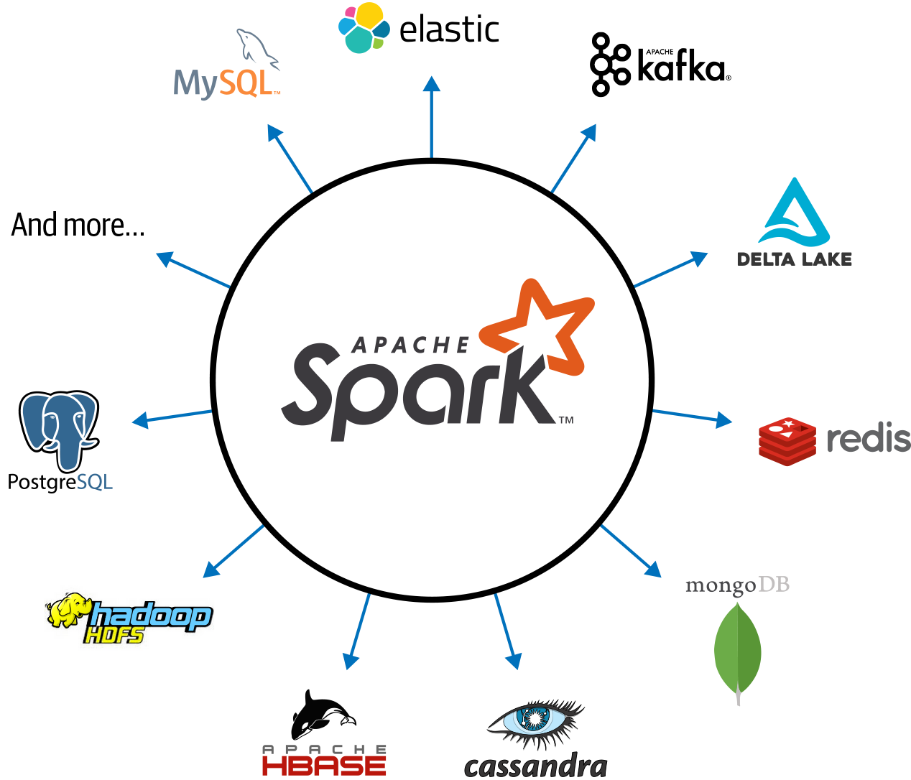
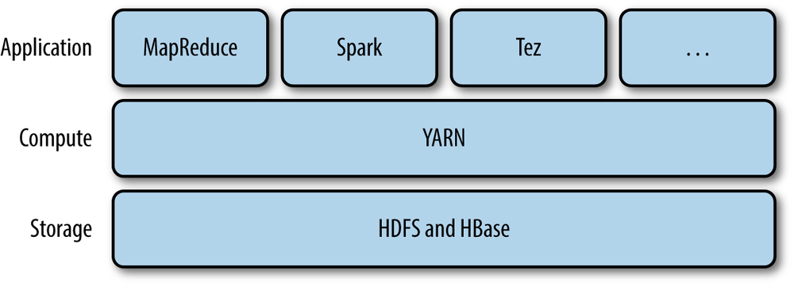

# Apache Spark

In this practice we will develop a simple ETL pipeline on Apache Spark.


### Prerequisites
* [Install docker](https://docs.docker.com/engine/install/) 
* Install a db client (i.e. [DBeaver](https://dbeaver.io/download/)) 

### What You Will Learn
- Apache Spark Concepts and Components
- Spark RDDs (Resilent Distributed Datasets)
- Spark Dataframes
- Spark SQL

# Practice

You're working on a clinic, and the clinic has a database of the appointments that were made between the patient and the doctor.

The clinic provides you CSV files with historical data of the appointments and they ask you to load the data to the database.


### Requirements
* Process Clinic's CSV files to load them into PostgreDB.

## Step 1

### Spark

Apache Spark is an open-source distributed computing framework built on Scala and it's used for big data processing and analytics. Currently Spark supports multiple languages including **Java, Scala, Python, and R**. Also is capable to connect to different sources (such as databases, hdfs, files, cloud services), able to transform data and load data to sources.



### How Does Spark Work?

Apache Spark uses a distributed **in-memory** computing model that allows it to process large amounts of data in parallel. Such memory can be RAM memory or GPU memory that allows spark to be fast while extracting, processing and loading the data.


### Spark Components

Spark has the following components:

+ **Driver**: The driver program is responsible for coordinating the Spark application. It runs on the client machine and creates the SparkContext, which is the entry point for any Spark functionality. The driver program is responsible for dividing the tasks into smaller tasks and sending them to the executors.
+ **Executors**: Executors are worker nodes that run tasks assigned by the driver program. They run on the cluster and are responsible for executing the tasks, storing data, and communicating with the driver program.
+ **Master**: The master node is responsible for managing the allocation of resources to the workers. It communicates with the workers to allocate resources and monitor their performance.
+ **Worker**: The worker node runs the tasks assigned by the driver program. It communicates with the master to receive tasks and allocate resources.

### Spark Job Execution

When a Spark job is submitted, the **driver** program breaks the job into smaller tasks and sends them to the **executors**. Each executor runs tasks in parallel, and once a task is completed, the result is sent back to the driver program. The driver program collects the results from all the tasks and combines them to produce the final output.

Spark is designed to handle large amounts of data, and it does so by dividing data into partitions. Each partition is processed by a single executor in parallel. Spark provides a default partitioning strategy, but it also allows you to customize the partitioning strategy for better performance.


### Spark Run Modes

Spark has multiple run modes according to the infrastructure where is run:

+ **Standalone**: This mode is used to run Spark on a single machine or cluster without using any other cluster manager. The standalone mode comes bundled with Spark and provides a simple way to set up a cluster.
+ **YARN**: This mode is used to run Spark on a Hadoop cluster managed by YARN (Yet Another Resource Negotiator). YARN manages resources like CPU and memory across the cluster and ensures efficient resource utilization.
Apache Mesos: Apache Mesos is a distributed systems kernel that provides efficient resource isolation and sharing across distributed applications. Spark can run on Mesos to take advantage of its resource management capabilities.
+ **Kubernetes**: Kubernetes is a container orchestration platform that automates the deployment, scaling, and management of containerized applications. Spark can run on Kubernetes to leverage its containerization features and cluster management capabilities.
+ **Amazon EMR**: Amazon EMR (Elastic MapReduce) is a managed Hadoop service offered by Amazon Web Services. Spark can run on EMR to process large-scale data on the cloud and leverage AWS resources like S3 and EC2.
+ **Databricks**: Databricks is a cloud-based big data processing and analytics platform built on top of Apache Spark. Databricks provides a managed Spark cluster and a unified analytics platform for data engineering, machine learning, and business intelligence.



### Spark Libraries

Spark has different Libraries such as:

+ **Spark RDDs (Spark Core)**: RDDs (Resilient Distributed Datasets) are a fundamental data structure in Spark. RDDs are immutable distributed collections of objects that can be processed in parallel. RDDs can be created from Hadoop InputFormats or by transforming other RDDs. **RDDs are the core data structure in Spark** and serve as the building blocks for all other libraries and APIs.
+ **Spark DataFrames**: Spark DataFrames are a distributed collection of data organized into named columns. They are similar to tables in a relational database and can be manipulated using SQL-like queries. Spark DataFrames provide a more optimized and efficient way to process structured data compared to RDDs.
+ **Spark SQL**: Spark SQL is a Spark module that provides support for structured data processing. It allows you to query data using SQL and provides a DataFrame API for manipulating data. Spark SQL also supports reading and writing data from various structured data sources like JDBC, Avro, and Parquet.
+ **Spark Streaming**: Spark Streaming is a library used for real-time stream processing. It provides a high-level API for processing data in real-time and supports various data sources like Kafka, Flume, and Twitter. With Spark Streaming, you can perform real-time analytics on live data streams.
+ **GraphX**: GraphX is a library for graph processing in Apache Spark. It provides an API for creating and manipulating graphs and supports various graph algorithms like PageRank and connected components. With GraphX, you can analyze and process large-scale graph data.
+ **MLlib**: MLlib is a library for machine learning in Apache Spark. It provides an API for building machine learning models and supports various algorithms like classification, regression, clustering, and collaborative filtering. With MLlib, you can perform machine learning tasks on large-scale datasets.


First let's start the containers from the docker-compose.yml with following command:

```
docker-compose up -d
```

The docker-compose command will start two containers that is a **postgre_db** and **python_app**, also the postgre_db will initialize a clinic database from **postgres/clinic.sql** file.

## Step 2

### Spark RDDs

**Spark RDDs (Resilient Distributed Datasets)** are immutable distributed collections of objects that can be processed in parallel.

### Spark Context

**Spark Context** is the entry point for any Spark functionality. It provides a way to interact with a Spark cluster and create RDDs.

### Data Processing

Spark supports two main types of operations:

+ **Transformations**: Transformations are operations that create a new RDD from an existing RDD. Examples of transformations include map, filter, and reduceByKey.
+ **Actions**: Actions are operations that trigger the execution of a Spark job and return results to the driver program. Examples of actions include collect, reduce, and count.

Now let's create a bash session to python_app with following command:

```
docker-compose exec python_app bash
```

Once in the container's bash session, then move to code directory with following command:

```
cd code
```

Now run the python file with the following command

```
python clinic_rdd
```


## Conclusion

Overall, Apache Spark is a powerful open-source distributed computing framework used for big data processing and analytics. It is built for speed and supports multiple languages including Java, Scala, Python, and R. Spark provides a wide range of libraries and APIs for data processing, machine learning, graph processing, and stream processing.

